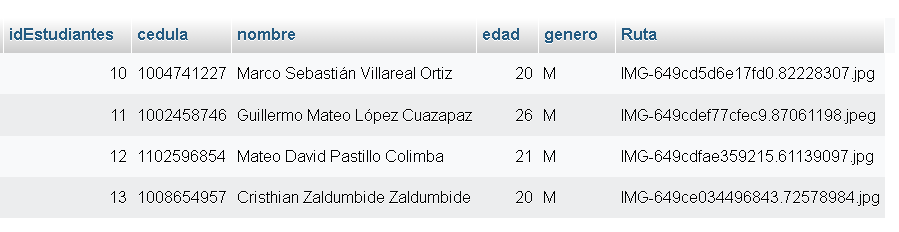

# SISTEMA_ALUMNOS
Sistema de prueba enlazado a MySQL con el fin de ejecutar CRUD visual y control de sesiones en Php 

1. La BDD se encuentra en la carpeta principal a nombre de "plataformas.sql" importar.
2. Configurar controladores.
3. Trabajado en MVC.

